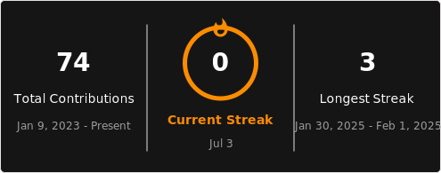

#  👋 I'm Abdelrahman Ismail

🤖 AI Engineer | Generative AI, Machine Learning & Computer Vision
🛠️ Building End-to-End AI Solutions | FastAPI | Python
📍 Cairo, Egypt

AI Engineer with hands-on experience in Machine Learning, Deep Learning, Natural Language Processing (NLP), Computer Vision, and Generative AI. I build and deploy end-to-end AI applications — from RAG systems and Arabic Text-to-SQL solutions to computer vision assistants and intelligent chatbots — and I enjoy turning AI research into practical, real-world products.

🔭 Currently focused on: AI Engineering · Machine Learning Engineering · NLP Engineering · Computer Vision Engineering
📬 Open to new opportunities — let's connect and build something impactful together.

---

## 🌐 Connect with me

---

## 📊 GitHub Stats
 
 

---

## 🚀 Tech Stack

### 👨‍💻 Languages

### 🤖 AI / ML

### 🌐 Frameworks & Web Dev

### ☁️ Cloud & DevOps

### 🛠 Developer Tools & Systems

---

## 🧠 Current Focus
- 🤖 Building Smart AI Assistants
- 🔍 RAG Systems & Semantic Search
- ☁️ Deploying AI on Cloud (GCP)
- 🧠 Deep Diving into Algorithms & Databases

---

<!-- LAST-UPDATED:START -->
🕒 Last updated: 2026-07-17 04:19 EEST
<!-- LAST-UPDATED:END -->

⭐ *Always building. Always learning.*
